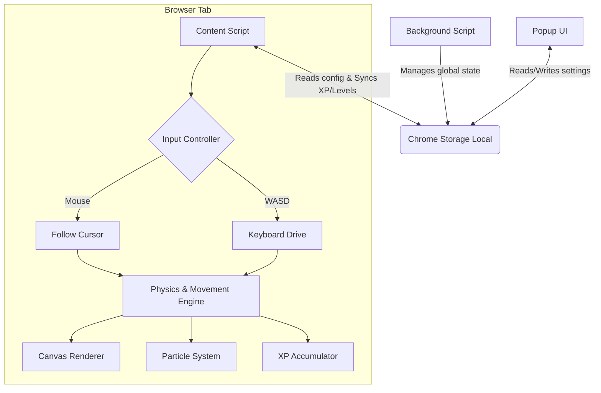
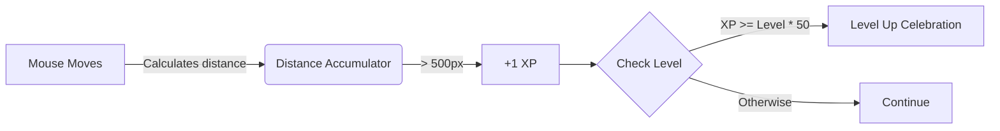

# Tiny Guy

**A tiny pixel companion that follows your cursor — earn XP, level up, and watch your little buddy come alive!**

Tiny Guy places a cute, tiny pixel-art character on every webpage. He follows your cursor, leaves colorful pixel dust trails, earns XP as you browse, and celebrates every level-up with a burst of particles. 

## Features

- **Cursor Companion**: A tiny pixel character follows your cursor across every webpage.
- **Leveling System**: Earn XP by moving. Level up and unlock celebrations!
- **Step Counter**: Tracks total pixels traveled across all tabs.
- **Pixel Dust Trail**: Colorful square particles in retro colors trail behind you.
- **Idle Bounce**: Character does a little hop when idle for 5 seconds.
- **Gameboy Style Control Panel**: A beautifully styled retro Gameboy popup menu to manage your companion.
- **Keyboard Control (WASD)**: Toggle keyboard mode to drive him around with W, A, S, D and click on elements with K.

## Game Engine Architecture

## How XP Works

The Tiny Guy game engine runs constantly as you browse, converting your physical mouse movements into game progression.

## Installation

1. Clone or download this repository.
2. Open Chrome and navigate to `chrome://extensions/`
3. Enable **Developer mode** (top right toggle).
4. Click **Load unpacked** and select the project folder.
5. Click the extension icon to open the retro control panel!

## Controls & Configuration

| Setting | Description |
|---------|------------|
| **Power** | Turn the extension on or off entirely. |
| **Scale** | Adjust the character's size (1% to 25%). |
| **Speed** | Adjust how fast he follows you. |
| **Anim Speed** | Control the sprite animation framerate. |
| **Drop Shadow** | Toggle the retro drop shadow effect. |
| **Keyboard Control**| Turn off mouse follow to drive him with WASD. Press K to click! |

## Tech Stack

- Pure vanilla JavaScript
- Chrome Extension Manifest V3
- HTML5 Canvas for high-performance rendering
- CSS3 with retro Gameboy aesthetic
- Google Fonts (Orbitron)

## License

MIT License — see LICENSE for details.
